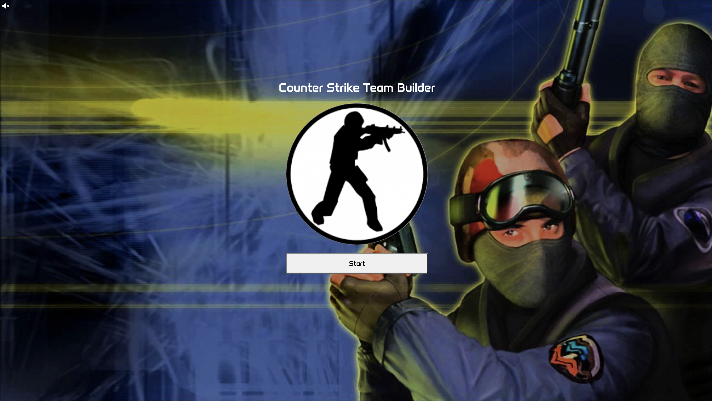
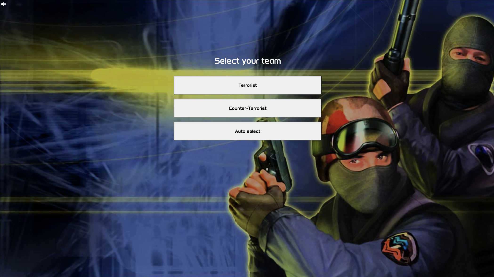
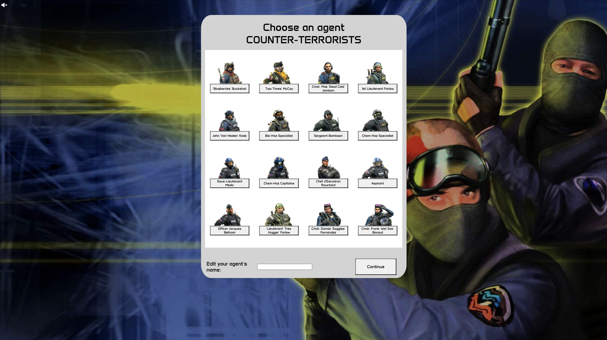
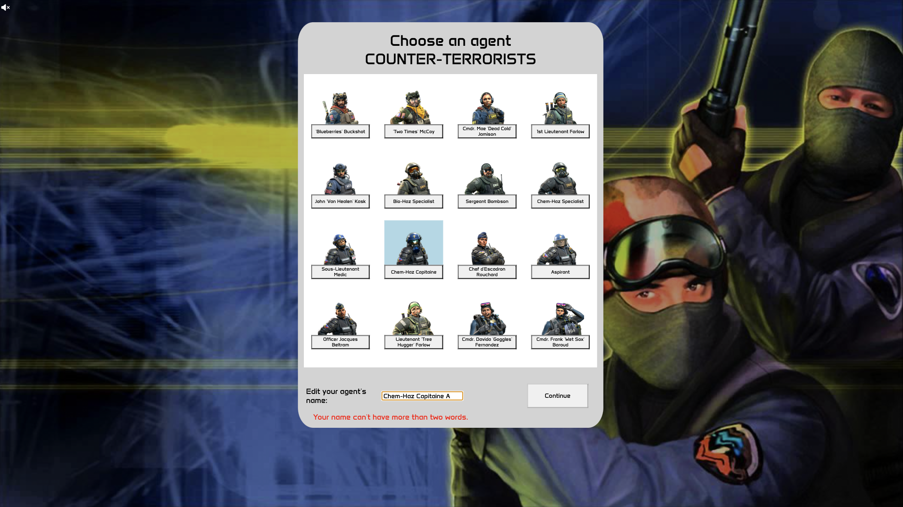
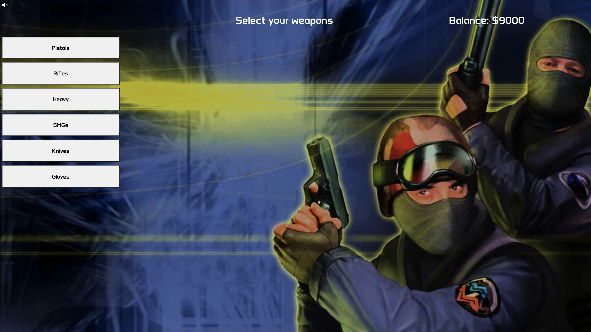
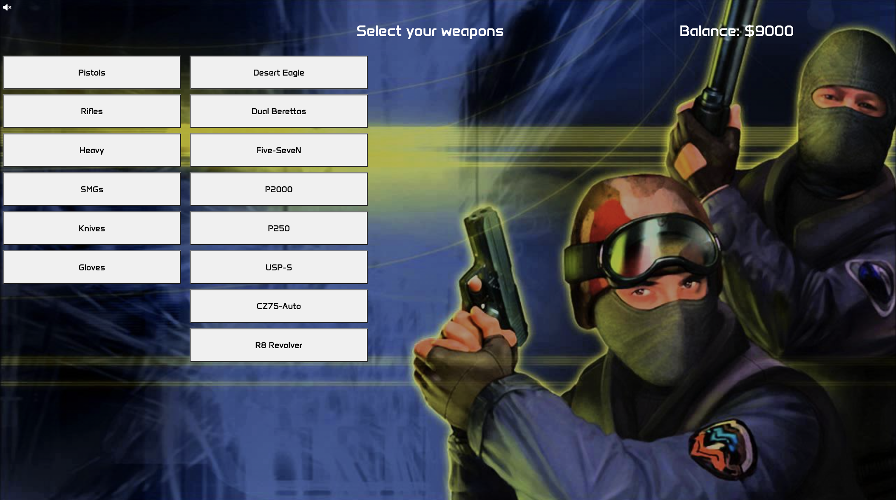
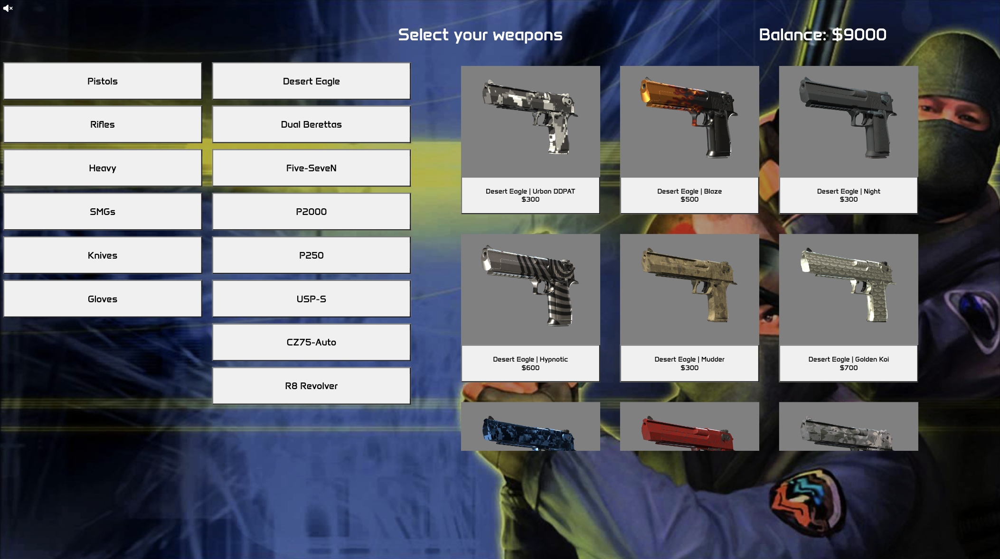
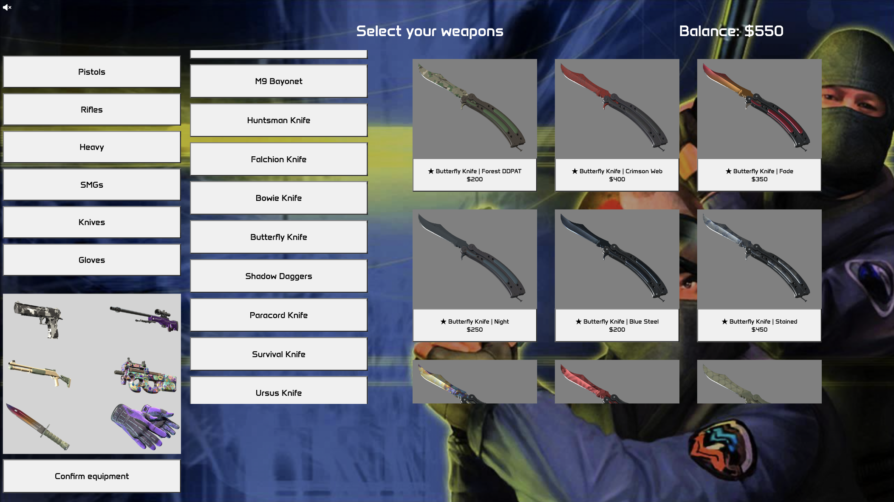

# INFO6122 - Programming JavaScript
## Course Project - CS Team Builder
### Livio Reinoso - ID 1165606
---
### Table of contents
1. [Start Screen](#Start-screen)
2. [Team Selection Screen](#select-team-screen)
3. [Character Selection](#select-agent-screen)
4. [Weapon Selection](#Weapon-Selection-screen)
5. [Character Overview](#character-overview-screen)
6. [Team Overview](#team-overview)
7. [Enemy Team Overview](#enemy-team-overview)
8. [Battle Simulator](#battle-simulator)
9. [Annex A - Cheat Codes](#annex-a---cheat-codes)
10. [Annex B - Available Maps](#Annex-B---Available-Maps)
11. [Deployment Status](#Deployment-Status)
---
#### Start screen

After starting the application the following screen is being shown:

Notice that there is a speaker icon in the upper left corner. By clicking on it the background music will start playing throughout the application execution.

By clicking on the start button the application will move forward to the "Select team" screen.

---
#### Select Team screen

Here you are able to select which team to play as: **Terrorists** of **Counter-Terrorists**.

If you're not sure which team to pick, or want the application to pick a random team for you, you can click on the **Auto select button** and a team will be assigned to you with a 50% chance of being one or the other.

---
#### Select Agent screen

On this third screen the user can select which agent will be using on this Counter-Strike match.

The list of agents is composed only of characters from the team selected on the previous screen.

There are a few validations implemented on the name input field. These are the following: 

- An agent has been selected from the list
- The input field is not empty
- The name consists of two or fewer words
- The name of the agent is 20 characters long or shorter

Whenever one of these validation rules is broken, a label will be displayed explaining how to correct this, and the *Continue* button gets disabled as shown on the screenshot below:

On top of that, the player can enter different cheat codes on this screen. All of these are detailed on the table on [Annex A](#annex-A---cheat-codes).

---
#### Weapon Selection screen

On this screen the user should select the different weapons for their equipment.

First, a category must be selected by clicking on a button from the leftmost button list. 

After a category is selected, the type of weapons available for that category will be displayed on a new button list

Then after picking a type of weapon, all the available skins along with their name, image and price will be displayed on the rightmost container, allowing the user to select any skin that they like.

This process should be repeated for every available category. After picking a weapon and skin for each category, these will be displayed beneath the category button list.

Once all six category weapons were selected (and after verifying that the player hasn't gone over balance) a *Confirm equipment* button will appear at the bottom of the screen.

If at any point the balance of all the selected weapons goes over what was allowed for the player (**$9000** by default, or a [customized money amount](#annex-a---cheat-codes)), the button will disappear and only reappear whenever this condition is met again.

Additionally, if the user hovers over any of the selected weapons on the container that shows their equipment the name of this weapon, the skin name and the price will be display by using the HTML title attribute.

---
#### Character Overview screen

On this screen the player will be able to see the selected character (either one from the list of the selected team, or a [custom avatar](#annex-a---cheat-codes)).

The character name and the remaining balance are displayed on top of the screen, while the middle of the screen is split in two parts: the left side will display the character avatar, and the right side will display the selected equipment.

On hover the equipment information is shown here too, with more detail than in the previous screen, again by using the HTML title attribute.

The bottom part of the screen is reserved for the input element where the user is supposed to enter the name for their team. 

A validation function will take care of checking that the entered name consists of a single word composed entirely of alphabetical characters, without any numbers or symbols.

If the team name is not valid, a label will be displayed explaining the error, and the *Create Team* button will be disabled until the error is fixed.

---
#### Team Overview

A team consists of four agents on each side, so three more agents are created to join the player's team, all of them with the same money constraints as the player's character.

The name of the agents are set to the language in which the player's browser is set to simulate that they are other players joining the same server. If the browser language is not supported by the API, it will default to US English.

Again on hover the detailed information of every weapon is shown. Additionally, every character will display to the right of their name the remaining balance after purchasing their equipment.

On the top of the page the team name can be seen, followed by two buttons: *Display enemy team* and *Start the battle*. The first button will flip the screen to [display the enemy team](#enemy-team-overview), while the second button will take the player to the [battle simulation](#battle-simulator).

---
#### Enemy Team Overview

This screen is the same as the previous one, only now displaying the enemy team instead of the player's team, which was created with the same criteria and limitations in mind.

The button on the top left corner is changed then to [Display my team](#team-overview), allowing the player go back and forth between both team display screens. The button on the top right corner will still start the [battle simulator](#battle-simulator).

---
#### Battle Simulator

After clicking the *Start the battle* button, the battle simulator screen is shown. If the music was playing, the background music will change to a battle theme. If it wasn't playing before, the player can still turn it on with the speaker icon on the top left corner.

Here both teams are faced against each other. Their names are being shown on the top of the screen, while the battle cards are displayed inside a container that will have a **background set randomly** amongst the [available game maps](#annex-b---available-maps).

Beneath the character cards there are four animated soldiers on each side, representing these characters. Whenever one of the agents falls in battle, the animated soldier linked to that character will fade away. The character's avatar will also fade out partially to show that the agent is down.

While taking damage, the health bars of each character will reduce. Whenever the remaining health of any of them gets to zero, it is considered that such agent is down.

After all the agents on a team are down the battle will be over and the animated soldiers will stop shooting.

---
#### Annex A - Cheat codes
| Cheat code | Description |
| ----------- | ----------- |
| umbra witch | Changes the character avatar to Bayonetta |
| final fantasy | Changes the character avatar to Cloud Strife |
| ohip | Changes the character avatar to Dr. Mario |
| squid ink | Changes the character avatar to an Inkling from Splatoon |
| stealyourheart | Changes the character avatar to Persona 5's Joker |
| peachespeaches | Changes the character avatar to Bowser |
| hyrule warrior | Changes the character avatar to Link |
| italian plumber | Changes the character avatar to Mario |
| chomp chomp | Changes the character avatar to Pac-Man |
| pikapika | Changes the character avatar to Wrestling Pikachu |
| bounty hunter | Changes the character avatar to Samus Aran |
| onewingedangel | Changes the character avatar to Sephiroth |
| animal crossing | Changes the character avatar to Isabelle |
| metal gear | Changes the character avatar to Solid Snake |
| sonic speed | Changes the character avatar to Sonic |
| dark force | Changes the character avatar to Darth Vader |
| thisistheway | Changes the character avatar to The Mandalorian |
| lh44blessed | Changes the character avatar to Lewis Hamilton |
| fairy tale | Changes the character avatar to Red Riding Hood |
| mariah carey | Changes the character avatar to Santa Claus |
| toriyama | Changes the character avatar to Son Goku |
| stan lee | Changes the character avatar to Spiderman |
| spiderverse | Changes the character avatar to Spider-Gwen |
| avengersassemble | Changes the character avatar to Tony Stark |
| the witcher | Changes the character avatar to Geralt of Rivia |
| ripandtear | Changes the character avatar to Doom Slayer |
| thelastcrusade | Changes the character avatar to Indiana Jones |
| tomb raider | Changes the character avatar to Lara Croft |
| klapaucius | Multiplies the available money by 2 |
| showmethemoney | Multiplies the available money by 10 |
| povertyfinance | Divides the available money by 2 |
| defaultpayload | Sets a default payload for the character to speed up testing |
| iwannaplay4real | Opens a playable web version of Counter-Strike on a new tab |

---
#### Annex B - Available Maps

- cs_assault
- cs_italy
- cs_poolday
- de_aztec
- de_dust
- de_inferno

---
#### Deployment Status
